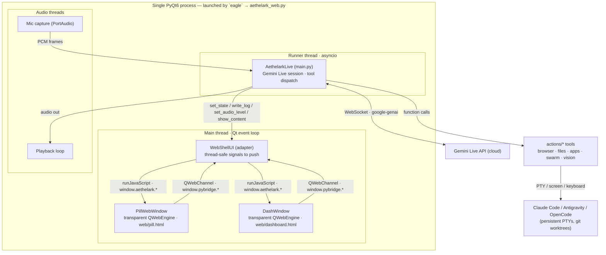
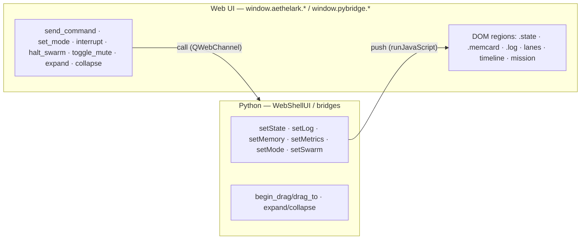
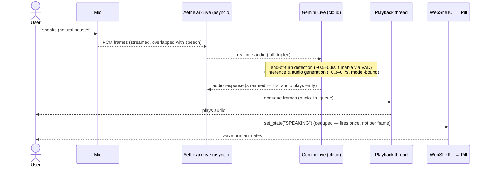
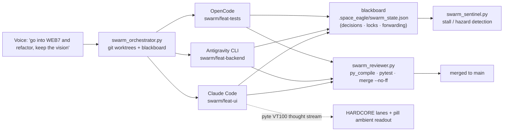

# Aethelark — Architecture & Data Flow

*Canonical, current architecture reference. For the **why**, see [`Aethelark_Vision.md`](Aethelark_Vision.md); for the **web-pivot decision detail**, see [`Aethelark_Web_Pivot_Plan.md`](Aethelark_Web_Pivot_Plan.md); for module specs see [`Aethelark_Specifications.md`](Aethelark_Specifications.md); for the journey see [`Aethelark_Roadmap.md`](Aethelark_Roadmap.md). Last updated 2026‑07‑23.*

---

## 1. What Aethelark is (one paragraph)

Aethelark is a voice‑and‑vision desktop **operator**: a native local daemon with full OS access that acts as a synthetic user — it types, clicks, browses, opens apps, edits files, and **conducts a swarm of rival AI coding CLIs** (Claude Code, Antigravity, OpenCode, …) toward a goal. Its brain is Google Gemini Live (native audio); its face is a **Dynamic Island pill** that expands into a **web‑rendered command console** with two states: **CASUAL** (calm, for the 90%) and **HARDCORE** (the swarm war room). See the Vision doc for the full thesis (*abstraction over the operator, not the model*).

---

## 2. Two coexisting front‑ends (important)

| App | Entry point | UI tech | Status |
|---|---|---|---|
| **Web app** (current) | `eagle` → `aethelark_web.py` | QWebEngine (renders the exact web artifact) + transparent native windows | **Active** — what `eagle` launches |
| **Classic app** | `python main.py` | Pure PyQt6 / QPainter (`ui.py`) | Kept as a lighter fallback |

Both drive the **same backend** (`main.AethelarkLive`). The web app wraps it in a thin adapter (`WebShellUI`) so the backend is unchanged.

---

## 3. Runtime topology (one process, multiple threads)

**Threading model** (why it's structured this way):
- **Main thread** runs the Qt event loop and *all* GUI work (QWebEngine, `runJavaScript`). Nothing else may touch the UI directly.
- **Runner thread** runs the asyncio loop: the Gemini Live session (`session.receive()`), and tool dispatch.
- **Audio threads**: PortAudio mic callback + a dedicated playback loop.
- The backend calls the UI through **`WebShellUI`**, whose methods emit **Qt signals** (thread‑safe) that are delivered to main‑thread slots, which then `runJavaScript` into the web views. This is the boundary that keeps cross‑thread GUI updates safe.

---

## 4. The UI ↔ daemon message contract

The web UI and the Python daemon talk over an **in‑process bridge** (QWebChannel) today; the *contract* is transport‑independent (portable to a Unix socket / WebSocket / Tauri later — see the Web Pivot Plan).

- **Daemon → UI (push):** `setState`, `setLog`, `setMemory`, `setMetrics`, `setMode`, `setSwarm(agents/mission/timeline)`.
- **UI → Daemon (call):** `send_command`, `set_mode`, `interrupt`, `halt_swarm`, `toggle_mute`, `expand`, `collapse`, `begin_drag/drag_to`.

Full schema in [`Aethelark_Specifications.md`](Aethelark_Specifications.md#message-contract) and [`Aethelark_Web_Pivot_Plan.md`](Aethelark_Web_Pivot_Plan.md).

---

## 5. Voice pipeline (dominant‑latency path)

**Latency reality:** everything local is <100 ms; **Gemini dominates** — split into *end‑of‑turn detection* (tunable via `automatic_activity_detection`) and *inference* (model‑bound). Streaming + optimistic UI mask perceived latency. (See Roadmap → Open Items.)

---

## 6. Swarm orchestration (HARDCORE)

Agents run in **isolated git worktrees** (spatial partitioning); the **blackboard** broadcasts architectural decisions (register forwarding); the **sentinel** detects stalls/hazards; the **reviewer** verifies and merges. Thought streams are extracted from each agent's PTY via **pyte** (a virtual VT100 screen) and surfaced in the HARDCORE lanes. *(Swarm→UI live wiring is the next build — see Roadmap.)*

---

## 7. Key components by layer

- **Entry / shell:** `aethelark_web.py` (web app: `WebShellUI`, `PillWebWindow`, `DashWindow`, bridges), `main.py` (`AethelarkLive` backend + `main()`), `ui.py` (classic QPainter UI + shared helpers: `make_spring_curve`, `load_app_fonts`, `PillWidget`).
- **Web UI:** `web/build_app_ui.py` → `web/dashboard.html`; `web/build_pill.py` → `web/pill.html`; `web/artifact_reference.html` (the approved design, source of truth).
- **Brain / IO:** `core/` (llm_client, tts, stt, installer), `google-genai` Live session in `main.py`.
- **Tools:** `actions/*` (browser_control, file_controller, open_app, computer_control, screen_processor, web_search, send_message, youtube_video, …).
- **Swarm:** `actions/pty_session.py`, `agent_screen.py`, `swarm_orchestrator.py`, `swarm_sentinel.py`, `swarm_reviewer.py`, `visual_verifier.py`, `repo_map.py`.
- **Memory:** `memory/memory_manager.py` (long‑term facts → `long_term.json`), `memory/config_manager.py`.
- **Remote:** `dashboard/server.py` (local HTTPS + SSE swarm telemetry; phone remote via QR).

Full file map with responsibilities: [`Aethelark_Specifications.md`](Aethelark_Specifications.md).
