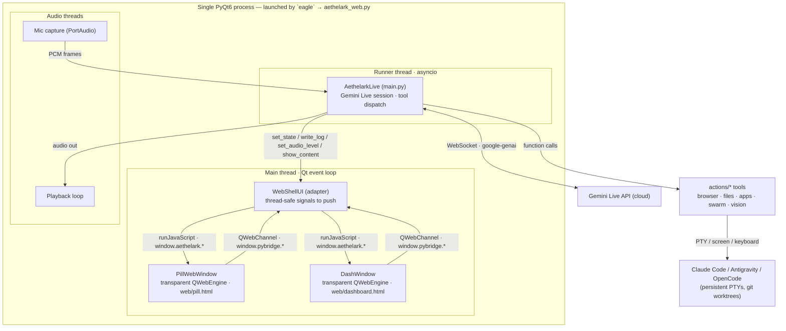
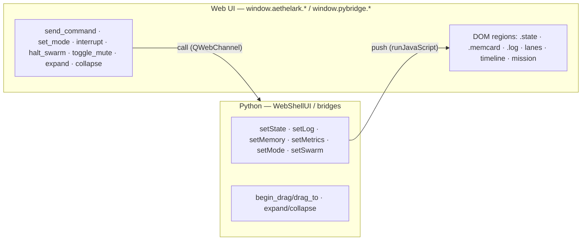
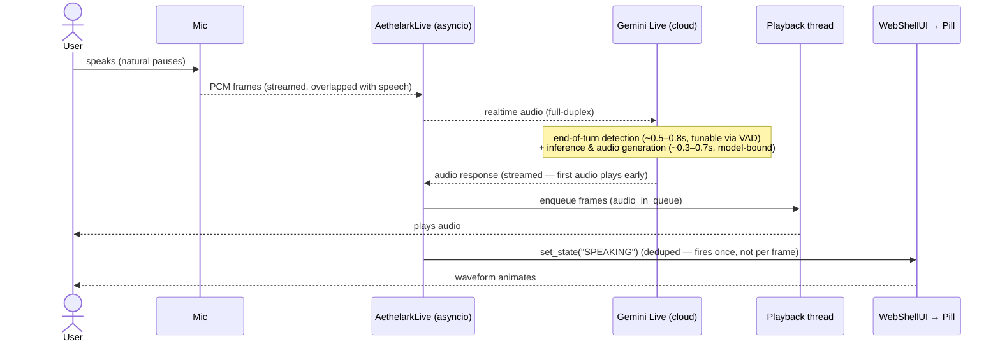
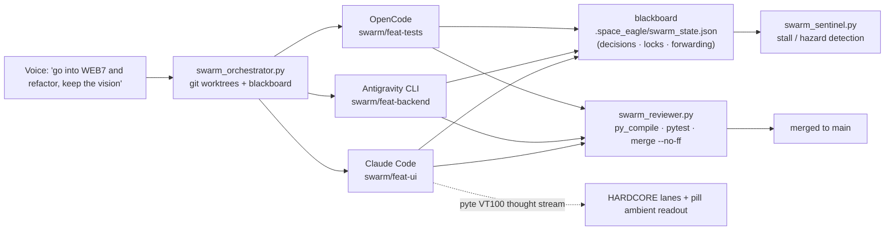
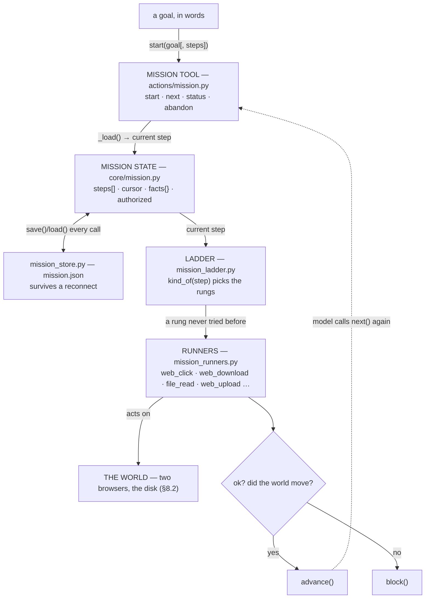
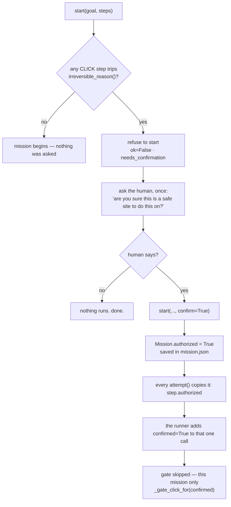

# Aethelark — Architecture & Data Flow

*Canonical, current architecture reference. For the **why**, see [`Aethelark_Vision.md`](Aethelark_Vision.md); for module specs see [`Aethelark_Specifications.md`](Aethelark_Specifications.md); for the living state of play see [`docs/Aethelark_Roadmap.md`](docs/Aethelark_Roadmap.md). §1–§7 describe the UI shell (last updated 2026‑07‑23); §8 covers the mission loop, added 2026‑08‑13.*

---

## 1. What Aethelark is (one paragraph)

Aethelark is a voice‑and‑vision desktop **operator**: a native local daemon with full OS access that acts as a synthetic user — it types, clicks, browses, opens apps, edits files, and **conducts a swarm of rival AI coding CLIs** (Claude Code, Antigravity, OpenCode, …) toward a goal. Its brain is Google Gemini Live (native audio); its face is a **Dynamic Island pill** that expands into a **web‑rendered command console** with two states: **CASUAL** (calm, for the 90%) and **HARDCORE** (the swarm war room). See the Vision doc for the full thesis (*abstraction over the operator, not the model*).

---

## 2. Two coexisting front‑ends (important)

| App | Entry point | UI tech | Status |
|---|---|---|---|
| **Web app** (current) | `eagle` → `aethelark_web.py` | QWebEngine (renders the exact web artifact) + transparent native windows | **Active** — what `eagle` launches |
| **Classic app** | `python main.py` | Pure PyQt6 / QPainter (`ui.py`) | Kept as a lighter fallback |

Both drive the **same backend** (`main.AethelarkLive`). The web app wraps it in a thin adapter (`WebShellUI`) so the backend is unchanged.

**Why QWebEngine, not Electron or Tauri** — decided 2026‑07‑22, executed in Era 2 (see the roadmap). QPainter has a hard ceiling: it cannot reproduce `backdrop-filter: blur()`, CSS blend modes, or exact CSS the way a browser does, and pixel-exact parity with the approved web artifact needed a real browser engine. Electron was rejected outright — heaviest footprint and still leaves PyQt underneath for the OS-access layer, no upside. Tauri (Rust host + OS webview) was deferred, not rejected: the web UI and its message contract are portable, so the host is swappable later without repainting a pixel, only worth doing if the ~130MB Chromium footprint ever costs adoption. `QWebEngineView` embedded in the same PyQt process, bridged in-process via `QWebChannel`, was the option that kept one process, one language, and pixel-exact CSS all at once.

---

## 3. Runtime topology (one process, multiple threads)

**Threading model** (why it's structured this way):
- **Main thread** runs the Qt event loop and *all* GUI work (QWebEngine, `runJavaScript`). Nothing else may touch the UI directly.
- **Runner thread** runs the asyncio loop: the Gemini Live session (`session.receive()`), and tool dispatch.
- **Audio threads**: PortAudio mic callback + a dedicated playback loop.
- The backend calls the UI through **`WebShellUI`**, whose methods emit **Qt signals** (thread‑safe) that are delivered to main‑thread slots, which then `runJavaScript` into the web views. This is the boundary that keeps cross‑thread GUI updates safe.

---

## 4. The UI ↔ daemon message contract

The web UI and the Python daemon talk over an **in‑process bridge** (QWebChannel) today; the *contract* is transport‑independent (portable to a Unix socket / WebSocket / Tauri later — see the Web Pivot Plan).

- **Daemon → UI (push):** `setState`, `setLog`, `setMemory`, `setMetrics`, `setMode`, `setSwarm(agents/mission/timeline)`.
- **UI → Daemon (call):** `send_command`, `set_mode`, `interrupt`, `halt_swarm`, `toggle_mute`, `expand`, `collapse`, `begin_drag/drag_to`.

Full schema in [`Aethelark_Specifications.md`](Aethelark_Specifications.md#message-contract).

---

## 5. Voice pipeline (dominant‑latency path)

**Latency reality:** everything local is <100 ms; **Gemini dominates** — split into *end‑of‑turn detection* (tunable via `automatic_activity_detection`) and *inference* (model‑bound). Streaming + optimistic UI mask perceived latency. (See Roadmap → Open Items.)

---

## 6. Swarm orchestration (HARDCORE)

Agents run in **isolated git worktrees** (spatial partitioning); the **blackboard** broadcasts architectural decisions (register forwarding); the **sentinel** detects stalls/hazards; the **reviewer** verifies and merges. Thought streams are extracted from each agent's PTY via **pyte** (a virtual VT100 screen) and surfaced in the HARDCORE lanes. *(Swarm→UI live wiring is the next build — see Roadmap.)*

---

## 7. Key components by layer

- **Entry / shell:** `aethelark_web.py` (web app: `WebShellUI`, `PillWebWindow`, `DashWindow`, bridges), `main.py` (`AethelarkLive` backend + `main()`), `ui.py` (classic QPainter UI + shared helpers: `make_spring_curve`, `load_app_fonts`, `PillWidget`).
- **Web UI:** `web/build_app_ui.py` → `web/dashboard.html`; `web/build_pill.py` → `web/pill.html`; `web/artifact_reference.html` (the approved design, source of truth).
- **Brain / IO:** `core/` (llm_client, …), `google-genai` Live session in `main.py`. Speech is not a separate layer: the Live session takes 16 kHz microphone PCM and returns 24 kHz audio with `input_audio_transcription` and `output_audio_transcription` enabled, so the model does both directions itself.
- **Tools:** `actions/*` (browser_control, file_controller, open_app, computer_control, screen_processor, web_search, send_message, youtube_video, …).
- **Swarm:** `actions/pty_session.py`, `agent_screen.py`, `swarm_orchestrator.py`, `swarm_sentinel.py`, `swarm_reviewer.py`, `visual_verifier.py`, `repo_map.py`.
- **Memory:** `memory/memory_manager.py` (long‑term facts → `long_term.json` in the platform user‑data directory, never inside the checkout), `memory/config_manager.py`.
- **Remote:** `dashboard/server.py` (local HTTPS + SSE swarm telemetry; phone remote via QR).

Full file map with responsibilities: [`Aethelark_Specifications.md`](Aethelark_Specifications.md).

---

## 8. The mission loop — perception and action on the web

*Added 2026‑08‑13. This is the eagle's ability to take a goal in plain words and carry it out as a sequence of verified actions, unrelated to the UI shell above. A rendered, hand-diagrammed version of this section exists as a published reference artifact; the mermaid diagrams below are the git-tracked equivalent, kept in sync by hand.*

### 8.1 One step's journey

Every call to the `mission` tool is the same shape: load the mission, walk the CURRENT step through the ladder, and only advance the cursor once the world has been re-observed. Nothing is marked done because a call returned — only because it was checked.

A rung that already failed on the current step is never offered again — not retried on the next call, not retried after a reconnect. A blocked mission stays blocked; every rung already failed once.

### 8.2 Two browsers, two jobs

There is no one eagle browser. The ladder reaches for a hidden one first, and only escalates to a visible one when the hidden one can't get through — a bot wall, a sign-in.

| | `EagleBrowser` — `actions/grounding/web/browser.py` | `browser_control` — `actions/browser_control.py` |
|---|---|---|
| profile | `~/.local/share/aethelark/browser` | `~/.aethelark_profiles/chrome` |
| visibility | headless requested → tries a private Xvfb display (`:77`) first, headed but on a screen nobody watches; no Xvfb → genuinely headless | deliberately **visible** — `--start-maximized`, CDP port 9222; this is where a sign-in happens |
| reads via | `COLLECT_JS` — structural, never rendered to you | the same collector, on a real visible tab |
| rungs served | `web_open · web_click · web_type · web_look · web_download · web_upload` | `user_open · user_click · user_type · user_look` |

Escalates left → right only when the hidden browser can't reach the control. **Fixed 2026-08-13:** `browser_control` used to fetch/launch a real window before validating the requested action, so a bad action name opened a visible browser before being refused — the action is now checked first (`_INTERACTIVE_ACTIONS`, pinned by a regression test).

### 8.3 The ladder never repeats a failure

Ordering is accuracy, not preference — the DOM knows exactly where a control is; vision only guesses (measured live, ~650px off).

| step kind | rungs, in order |
|---|---|
| open | `web_open → browser_open → user_open` |
| click | `web_click → user_click → screen_click → vision_click` |
| type | `web_type → user_type → screen_type → press_keys` |
| read | `web_look → user_look → screen_look` |
| download | `web_download` |
| upload | `web_upload` |
| file_read | `file_read` |
| file_write | `file_fill → file_write` |

### 8.4 One nod covers the whole mission

A step that would commit something irreversible is refused by default. Instead of asking mid-mission — which breaks "no approval prompts between steps" and lands as a surprise after the model already said the mission was under way — the plan is scanned up front: one question, before anything runs, remembered for every step after it.

`confirmed` is never in the model's own tool schema — only mission code, having already gotten the human's yes, can set it.

### 8.5 Where it stands

Proven on the owned test rig (`tools/mission_e2e.py` + `tools/testsite/`): download → read → fill → upload → submit, verified from the server's own record, clean across 4+ runs. Not yet proven on a genuinely unknown site — `tools/mission_smoke.py` (default goal: MakerWorld) plans live with the real model but has no independent check the way the owned rig does. That's the next test. Full detail and priority order: [`docs/Aethelark_Roadmap.md`](docs/Aethelark_Roadmap.md).
