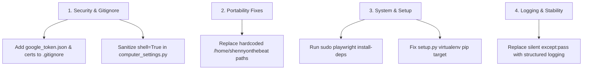

# You Should Look At This: Comprehensive Codebase Audit & Recommendations

> [!IMPORTANT]
> **Executive Summary:** A full sweep of the **Space-Eagle** codebase was performed across all 56 Python files, configuration files, and system dependencies. While the Python syntax is clean, several critical security concerns, hardcoded user paths, silent exception traps, system dependency gaps, and UI thread safety risks require your attention.

---

## 1. Security Risks & Unprotected Secrets

> [!WARNING]
> **Secrets in Danger of Git Leakage**
> - **Un-ignored Sensitive Files:** `.gitignore` ignores `config/api_keys.json`, but **DOES NOT** ignore `config/google_token.json` or `config/certs/aethelark.key`. If pushed to a public repository, your OAuth refresh tokens and SSL private keys will be exposed.
> - **Recommendation:** Add the following to `.gitignore`:
>   ```gitignore
>   config/google_token.json
>   config/certs/*.key
>   config/certs/*.crt
>   ```

### Command Injection & Untrusted Code Execution
1. **Shell Injection in Brightness Controls:**
   - [actions/computer_settings.py:L165](file:///home/shennyonthebeat/Projects/Space-Eagle/actions/computer_settings.py#L165) and [L194](file:///home/shennyonthebeat/Projects/Space-Eagle/actions/computer_settings.py#L194) use `subprocess.run(..., shell=True)` executing nested `python3 -c` commands inside complex string interpolation for `xrandr`.
   - **Recommendation:** Replace `shell=True` string parsing with pure Python file reads (e.g. `/sys/class/backlight/` on Linux) or structured subprocess lists without `shell=True`.

2. **Unsafe Dynamic `exec()` in Desktop Controller:**
   - [actions/desktop.py:L97](file:///home/shennyonthebeat/Projects/Space-Eagle/actions/desktop.py#L97) uses `exec()` to run LLM-generated Python code. While `_build_sandbox()` filters basic builtins, standard Python `exec()` sandboxing can be bypassed via object graph navigation (`__subclasses__`).
   - **Recommendation:** Restrict LLM desktop output to a strict JSON action schema rather than raw Python code execution.

---

## 2. Hardcoded User Paths & Portability Breaks

> [!CAUTION]
> Hardcoded paths pointing to `/home/shennyonthebeat/` will cause runtime `FileNotFoundError` exceptions when deployed on other machines or user accounts.

| Component | File & Line | Hardcoded Path | Recommended Fix |
| :--- | :--- | :--- | :--- |
| **UI Dynamic Island** | [ui.py:L2097](file:///home/shennyonthebeat/Projects/Space-Eagle/ui.py#L2097) | `/home/shennyonthebeat/Downloads/AE_dynamic_island_cutout.svg` | Use `Path(__file__).parent / "assets" / "images" / "AE_dynamic_island_cutout.svg"` |
| **Developer Mode** | [actions/developer_mode.py:L21](file:///home/shennyonthebeat/Projects/Space-Eagle/actions/developer_mode.py#L21) | `/home/shennyonthebeat/Projects/Space-Eagle` | Use `Path(__file__).resolve().parent.parent` |
| **Web Asset Builder** | [web/artifact_source_build.py:L4](file:///home/shennyonthebeat/Projects/Space-Eagle/web/artifact_source_build.py#L4) | `/home/shennyonthebeat/Projects/Space-Eagle/assets/fonts` | Use relative path `Path(__file__).resolve().parent.parent / "assets" / "fonts"` |

---

## 3. System Dependencies & Setup Script Failures

1. **Missing Playwright Host System Libraries:**
   - Running Playwright browser automation fails on Linux due to missing shared libraries (`libevent-2.1`, `libgstreamer-plugins-bad`, `libavif16`).
   - **Recommendation:** Run system dependency installation:
     ```bash
     sudo playwright install-deps
     ```
2. **`setup.py` PIP Breakdown on PEP 668 Environments:**
   - [setup.py](file:///home/shennyonthebeat/Projects/Space-Eagle/setup.py) calls `python3 -m pip install -r requirements.txt` directly. On modern Linux distributions (Debian 12+ / Ubuntu 24.04+), system Python prohibits direct pip installs (`externally-managed-environment`).
   - **Recommendation:** Update `setup.py` to target `.venv/bin/pip` or invoke pip inside the activated virtual environment.

---

## 4. Silent Exception Handling (110+ Locations)

> [!NOTE]
> The codebase contains over 110 silent exception blocks (`except Exception: pass` or `except: pass`).

- **Examples:**
  - [actions/agent_delegation.py:L112](file:///home/shennyonthebeat/Projects/Space-Eagle/actions/agent_delegation.py#L112)
  - [actions/browser_control.py:L266](file:///home/shennyonthebeat/Projects/Space-Eagle/actions/browser_control.py#L266)
  - [actions/agent_screen.py:L83](file:///home/shennyonthebeat/Projects/Space-Eagle/actions/agent_screen.py#L83)
  - [actions/computer_settings.py:L54](file:///home/shennyonthebeat/Projects/Space-Eagle/actions/computer_settings.py#L54)
- **Impact:** Sub-agent failures, failed audio backend switches, network timeouts, and PTY crashes fail silently without logging feedback to the user or HUD telemetry.
- **Recommendation:** Replace silent `pass` blocks with structured logging (`logger.debug(...)` or `logger.warning(...)`).

---

## 5. Qt GUI Thread Safety Risks (`ui.py`)

- **Issue:** Several asynchronous action callbacks update PySide6 Qt widgets directly from background worker threads.
- **Impact:** PySide/Qt strictly prohibits non-GUI thread updates to UI widgets, leading to intermittent application crashes, frozen frames, or SEGFAULTs during heavy multi-agent activity.
- **Recommendation:** Ensure all background thread UI updates are dispatched through Qt `Signal` / `Slot` mechanisms or `QMetaObject.invokeMethod`.

---

## 6. Strategic Architecture Handoff Alignment

- The strategy document [for_fable_to_look_at.md](file:///home/shennyonthebeat/Projects/Space-Eagle/for_fable_to_look_at.md) highlights building `actions/swarm_orchestrator.py` for **Git Worktree isolation** and implementing **`pyte` virtual terminal screen buffering** inside [actions/agent_delegation.py](file:///home/shennyonthebeat/Projects/Space-Eagle/actions/agent_delegation.py).
- **Status:** Both `pyte` and `playwright` are installed in `.venv`, enabling immediate execution of Phase 1 and Phase 2 from the handoff roadmap.

---

## 7. Recommended Action Plan


